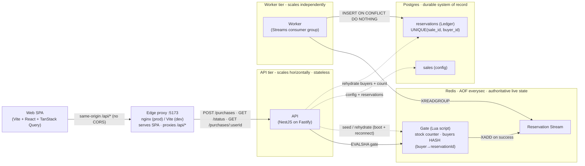
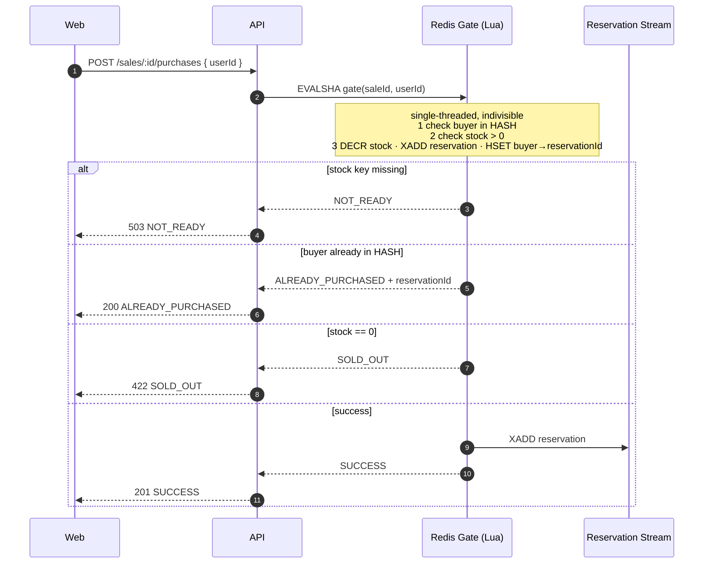
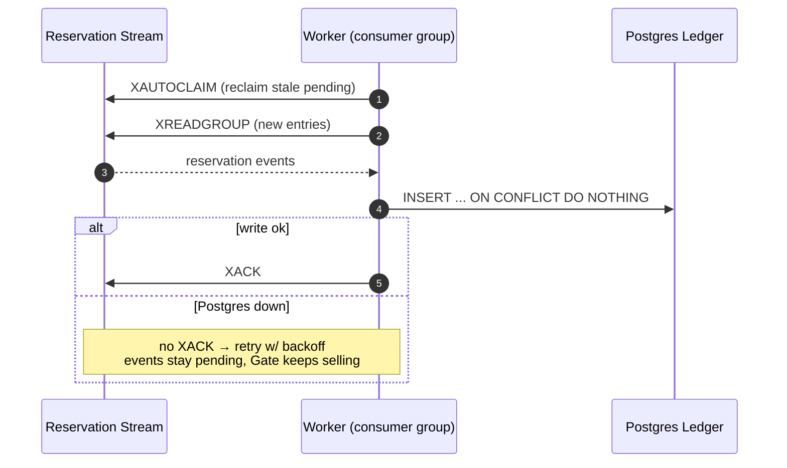
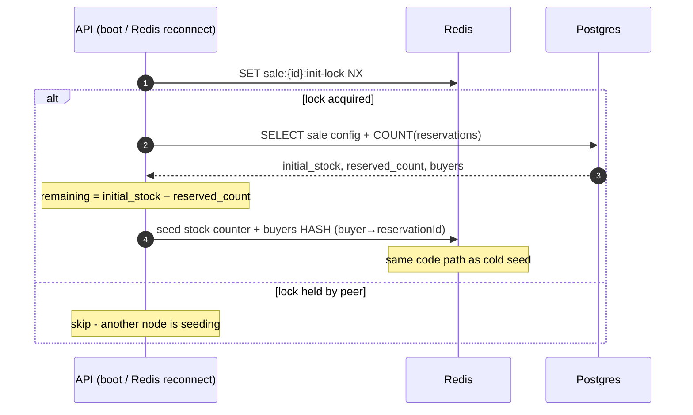

# Rush Sale

A high-throughput **flash-sale** platform for a single limited-stock product. Thousands of
buyers contend for a small stock; the system must **never oversell** and must enforce
**one item per user**, under spike load, within a configurable sale window.

The design centre of gravity is a single **Redis atomic Gate**: one Lua script decides
"decrement stock if available AND this buyer has none" as one indivisible operation. Redis
is single-threaded, so oversell and double-buys are *structurally* impossible - there is no
race window to lose. Durability is handled off the hot path by a separate **worker** that
drains a Redis Stream into a Postgres **Ledger** (the system of record).

## Design choices & tradeoffs

Every decision below buys a property the brief demands - **no oversell**, **one-per-user**,
**throughput under spike** - at a cost stated plainly. Full rationale lives in the
[ADRs](docs/adr); this table is the one-screen summary.

| Decision | Why | Tradeoff accepted |
|---|---|---|
| **Redis Lua Gate is the source of truth for live stock** ([ADR-0001](docs/adr/0001-redis-gate-async-ledger.md)) | One indivisible script in single-threaded Redis ⇒ oversell and double-buys are *structurally* impossible - no locks, no race window | Redis is the throughput ceiling **and** a SPOF. Mitigated, not removed: every key is `sale:{id}:*` so sales shard across a Redis Cluster; HA via Sentinel / managed Redis |
| **Durability is async** - the Gate `XADD`s to a Stream and a separate worker drains it into Postgres (no synchronous DB write on the buy path) ([ADR-0001](docs/adr/0001-redis-gate-async-ledger.md)) | Hot path stays O(1); a Postgres outage stalls only persistence while the Gate keeps selling | Eventual consistency - a reservation is durable a beat *after* it's confirmed. Reconciled by at-least-once delivery + `UNIQUE(sale_id, buyer_id)` + `ON CONFLICT DO NOTHING` |
| **AOF `appendfsync everysec`** (not `always`) | ~10× the write throughput of fsync-on-every-op | ≤1s of live state can vanish on a hard crash - backstopped by Ledger rehydrate, which can never oversell |
| **Business outcomes carry 4xx HTTP status** ([ADR-0003](docs/adr/0003-purchase-outcome-http-semantics.md)) | Status mirrors meaning (`SOLD_OUT`=422, upcoming=409, ended=410) - REST-honest and observable in any proxy/log | Clients must read the body `outcome`, not just the status class |
| **Separate API and worker processes** ([ADR-0005](docs/adr/0005-monorepo-and-separate-worker.md)) | Each tier scales on its own lever; a slow DB never touches buy latency | More moving parts and deploy units than a single process |
| **NestJS on the Fastify adapter** ([ADR-0002](docs/adr/0002-nestjs-on-fastify-adapter.md)) | DI/modules for testability; Fastify for throughput on the hot path | Framework overhead vs. raw Fastify |

The diagrams below show how these fit together; [**Why this holds up**](#why-this-holds-up) and
[**Scaling & bottlenecks**](#scaling--bottlenecks) drill into the correctness and the ceilings.

## Architecture at a glance



- **Redis** is authoritative for *live* stock during an active sale (AOF, `appendfsync everysec`).
- **Postgres** is the durable record and the **rehydration** source if Redis state is lost.
- **API** and **worker** are separate processes: a DB outage stalls only the worker (events
  buffer in the Stream) while the Gate keeps serving `SUCCESS`.

### Purchase - hot path



No oversell + one-per-user are decided inside one Lua script. Redis being single-threaded
means there is no race window - the event is enqueued the instant the Reservation exists,
so there is no dual-write gap.

### Persistence - worker drains the Stream



At-least-once delivery → the Ledger write must be idempotent. The natural key
`UNIQUE(sale_id, buyer_id)` makes the write exactly-once **and** is a DB-level
defense-in-depth backstop for one-per-user.

### Rehydration - recover live state from the Ledger



Boot seed and post-crash rehydrate are the **same** code path. AOF can lose ≤1s on a hard
crash; the Ledger backstops it so a cold rebuild can never oversell (ADR-0004).

### Failure modes

| Failure | Behaviour | Why it holds |
|---|---|---|
| Traffic spike (thundering herd) | Gate serializes atomically in Redis | single-threaded, no row lock contention |
| Postgres down | Gate keeps serving; events buffer in Stream | worker decoupled, never acks until write ok |
| Redis crash (AOF intact) | restart → AOF replays live state | `appendfsync everysec`, ≤1s loss |
| Redis state lost (AOF gone) | rehydrate from Ledger on boot | `remaining = initial − COUNT(reservations)` |
| Duplicate Stream delivery | second Ledger insert is a no-op | `ON CONFLICT DO NOTHING` on natural key |
| Double-click / retry buy | `ALREADY_PURCHASED` + original id, not an error | buyer HASH checked inside the Gate |

> The same diagrams are mirrored in [`docs/architecture.md`](docs/architecture.md).

## Why this holds up

| Concern | Mechanism |
|---|---|
| No oversell under spike | Single Lua script in single-threaded Redis - no race window |
| One per user | Buyer HASH checked *inside* the same Gate script |
| Exactly-once persistence | At-least-once Stream + `UNIQUE(sale_id, buyer_id)` + `ON CONFLICT DO NOTHING` |
| DB outage | Worker stops acking; Gate keeps selling; Stream buffers until recovery |
| Total Redis state loss | Rehydrate on boot: `remaining = initial_stock − COUNT(reservations)`, buyer HASH rebuilt |
| Crash window | AOF `everysec` loses ≤1s; the Ledger backstops a cold rebuild so it can't oversell |

## Scaling & bottlenecks

Each tier scales on its own lever; the honest ceiling is the **single Redis node**, and the
key layout makes the fix a config change, not a rewrite.

| Tier | Scale lever | Ceiling / bottleneck |
|---|---|---|
| API · Edge proxy | stateless → add replicas | CPU per request only |
| Worker | competing-consumer group → add consumers | drain rate vs. Stream arrival rate |
| **Redis Gate** | one node, single-threaded | **~10⁵ ops/s + it's a SPOF** |
| Postgres | off the hot path | worker write throughput (never on the buy path) |

**The single-Redis story, honestly.** One node is both the throughput ceiling and a single
point of failure - but every key is namespaced `sale:{id}:*` and each sale owns its Stream, so
**sharding by `saleId` across a Redis Cluster** spreads concurrent sales with zero Gate change.
A single hotter-than-one-node sale is the single-product limit by design (lever: a bigger box,
or partition the stock counter - deferred per ADR-0001). HA comes from Sentinel / managed Redis;
AOF + the Ledger rebuild correct live state on failover or cold start.

Full treatment - concurrency proof, per-tier mitigations, and a load runbook - in
[`docs/architecture.md`](docs/architecture.md#scaling--bottlenecks) and
[`docs/troubleshooting.md`](docs/troubleshooting.md#performance--load-symptom--bottleneck--mitigation).

## Stack

TypeScript · Turborepo + pnpm · NestJS on the **Fastify** adapter · **ioredis**
(`defineCommand` registers the Gate as a typed `EVALSHA`) · **Drizzle** + Postgres ·
Vite + React (Rolldown/Oxc) + TanStack Query · pino · Terminus health checks · Vitest +
Testcontainers · k6 · Biome (one-config lint + format) · Docker / Compose.

```
apps/
  api/    NestJS API (main.ts) + Streams worker (worker.ts), Drizzle schema, Redis Gate
  web/    Vite + React SPA - sale status + Buy button
  load/   k6 stress + correctness scenarios
```

## Requirements

The containerized path needs only Docker; Node and pnpm are for local dev.

| Tool | Version | Required for |
|---|---|---|
| **Docker** + Compose v2 | ≥ 24 | running the whole stack (`pnpm start`) - Redis, Postgres, API, worker, web |
| **Node.js** | ≥ 22 (developed on 26) | local (non-container) dev only |
| **pnpm** | ≥ 10 (`10.33.2`) | workspace package manager - `npm i -g pnpm` |
| **[k6](https://grafana.com/docs/k6/latest/set-up/install-k6/)** | ≥ 0.50 | load scenarios - **optional**: only the local-binary path needs it; `pnpm load:*` runs k6 in a container |

These TCP ports must be free on the host (the stack publishes them):

| Port | Service |
|---|---|
| `3000` | API |
| `5173` | Web SPA |
| `5432` | Postgres |
| `6379` | Redis |
| `8081` | pgweb - Postgres admin UI (only with `pnpm tools:up`) |
| `8082` | redis-commander - Redis admin UI (only with `pnpm tools:up`) |

## Run it - fully containerized (one command)

```bash
pnpm start          # docker compose --profile app up -d --build  (detached)
pnpm start:attach   # same, without -d - streams all container logs in the foreground
```

This builds and starts the whole stack: Redis, Postgres, a one-shot **migrate** (pushes the
Drizzle schema, then exits), the **API** (:3000, seeds `launch-2026` on boot), the **worker**
(Stream → Ledger), and the **web** SPA on **http://localhost:5173** (nginx). `depends_on`
health/`completed_successfully` gates ordering, so the API only starts once the schema is in
place. Tear down with:

```bash
pnpm down      # stop + remove the app containers (data under ./data/ is kept)
```

The app services live behind a Compose `app` profile, so `pnpm infra:up` (below) still brings
up Redis + Postgres only.

> **Persistent state lives in `./data/`** (`./data/postgres`, `./data/redis`) as bind mounts,
> not Docker-managed volumes - so it is easy to inspect and is gitignored. To wipe everything
> and start fresh, stop the stack and `rm -rf data/`.

## Run it - local dev (hot reload)

```bash
pnpm install
cp .env.example .env          # localhost defaults match docker-compose

pnpm infra:up                 # Redis + Postgres only
pnpm --filter @rush-sale/api db:push   # create tables

# two processes, two terminals:
pnpm --filter @rush-sale/api dev          # API on :3000 (seeds the default sale)
pnpm --filter @rush-sale/api dev:worker   # Stream → Ledger worker

pnpm --filter @rush-sale/web dev          # SPA on :5173
```

A default sale (`launch-2026`, stock 1000) is seeded from `.env` on API boot. Create more
via `POST /sales`.

## Inspect the data (admin UIs)

To watch the **actual** database rows and cache keys while the system runs, start the admin
UIs (behind a Compose `tools` profile, so they never run in the default or app stacks):

```bash
pnpm tools:up      # docker compose --profile tools up -d
```

| UI | URL | Backs |
|---|---|---|
| **pgweb** | http://localhost:8081 | Postgres - `sales`, `reservations` (the Ledger) |
| **redis-commander** | http://localhost:8082 | Redis - stock counter, buyers HASH, reservation Stream |

Both **auto-connect** to the running services (no login or manual registration). Stop them
with `pnpm tools:down`. Useful flow: make a purchase, watch the `sale:*:stock` key drop and
the Stream grow in redis-commander, then see the row land in `reservations` in pgweb once the
worker drains it.

## API

| Method | Path | Purpose |
|---|---|---|
| `GET`  | `/sales/:id/status` | product, status (`UPCOMING`/`ACTIVE`/`ENDED`), live remaining |
| `POST` | `/sales/:id/purchases` | body `{ "userId": "..." }` - attempt to secure the item |
| `GET`  | `/sales/:id/purchases/:userId` | has this buyer secured one? |
| `POST` | `/sales` | admin: define a sale (idempotent on `id`) |
| `GET`  | `/health` · `/ready` | liveness · readiness (Redis + Postgres) |

**Purchase outcomes** - the body `outcome` is authoritative, HTTP status mirrors it (ADR-0003):

| `outcome` | HTTP | Meaning |
|---|---|---|
| `SUCCESS` | 201 | reservation created |
| `ALREADY_PURCHASED` | 200 | buyer already has one (not an error) |
| `SOLD_OUT` | 422 | stock exhausted |
| `NOT_ACTIVE_UPCOMING` | 409 | sale hasn't started |
| `NOT_ACTIVE_ENDED` | 410 | sale is over |
| `NOT_READY` | 503 | sale not seeded yet (≠ sold out) |

```bash
curl -X POST localhost:3000/sales/launch-2026/purchases \
  -H 'content-type: application/json' -d '{"userId":"alice"}'
# {"outcome":"SUCCESS","remaining":999,"reservationId":"...-0", ...}
```

## Tests

```bash
pnpm --filter @rush-sale/api test        # unit (no Docker)
pnpm --filter @rush-sale/api test:int    # integration - boots REAL Redis + Postgres via Testcontainers
```

**Unit** (no infra) covers the business logic in isolation: the outcome→HTTP mapping (ADR-0003),
the purchase service's window short-circuit + Gate-code→outcome mapping, the sale service's
status / `SOLD_OUT` collapse / negative-cache behaviour, and the `BoundedTtlSet`.

**Integration** is the correctness centrepiece, and runs at two layers against real infra:

- `test/gate.int-spec.ts` - the Lua **Gate** directly: 1000 concurrent buyers against 100 stock
  yields **exactly 100 `SUCCESS`**, the rest `SOLD_OUT`; a 200-call retry storm from one buyer
  yields **exactly one `SUCCESS`** and 199 `ALREADY_PURCHASED`. Only a real Redis can run the Lua
  `EVAL` the proof depends on.
- `test/api.int-spec.ts` - the full stack over **HTTP** (Nest + real Redis + real Postgres):
  create → status → purchase → duplicate → check, the 4xx/404/400 contract, and a 200-buyers-vs-10-stock
  burst proving the concurrency control holds at the API edge, not just in the script.

## Lint & format

A single root [Biome](https://biomejs.dev) config (`biome.json`) lints and formats the whole
workspace - one toolchain, one pass:

```bash
pnpm lint      # biome check .  (lint + format diagnostics)
pnpm format    # biome check --write .  (apply safe fixes)
```

## Stress testing (k6)

With the stack up (`pnpm start`), run k6 **in a container** - no global install - from the repo root:

```bash
pnpm load:herd           # 1: thundering herd - 5k rps spike, p99 < 250ms, never oversells
pnpm load:one-per-user   # 2: 50 buyers × 40 retries - at most one SUCCESS each
pnpm load:window         # 3: outcomes match the live sale window (upcoming/active/ended)
pnpm load:fault-redis    # 4: kill Redis mid-run (see script) - fails clean, recovers, no oversell
```

These use the `grafana/k6` image (compose `load` profile) on the app network, hitting
`http://api:3000`. If you'd rather use a locally-installed k6 binary against the host port,
run it from the root via the package filter (no `cd`):

```bash
pnpm -F @rush-sale/load run herd   # also: one-per-user / window / fault-redis
```

Reset to a clean, freshly-seeded slate between runs (a scenario aborts if the sale is already
sold out from a prior run):

```bash
pnpm load:reset          # down → rm -rf data → rebuild + start detached (re-seeds launch-2026)
pnpm load:reset:attach   # same, but streams container logs in the foreground (no -d)
```

Each scenario encodes its pass/fail as **k6 thresholds**, so a run exits non-zero the moment
an invariant breaks - no eyeballing required:

- **herd** - `outcome_success ≤ 1000` (`abortOnFail`: oversell kills the run instantly),
  `p95 < 150ms`, `p99 < 250ms`, `http_req_failed < 1%`, `checks > 99%`.
- **one-per-user** - `outcome_success ≤ 50` (`abortOnFail`: one per buyer), `checks > 99%`.
- **window** - `checks > 99%` that every outcome agrees with the live sale window.
- **fault-redis** - failures tolerated during the outage (`http_req_failed < 40%`), but the
  no-oversell check must hold on **every** request (`checks > 99.9%`, `abortOnFail`).

**Cross-checked against the DB after any run (the invariant, independent of k6):**

```sql
-- never more reservations than stock, and no buyer twice:
SELECT count(*) FROM reservations WHERE sale_id = 'launch-2026';            -- ≤ initial_stock
SELECT sale_id, buyer_id, count(*) FROM reservations
  GROUP BY 1,2 HAVING count(*) > 1;                                         -- 0 rows
```

For scenario 4, restart Redis with `docker compose restart redis` (AOF replays) or, with Redis
stopped, `rm -rf data/redis` to force a **cold rehydrate from the Ledger** - either way the
invariant holds.

Full walkthrough - running each scenario, reading the k6 thresholds, and the independent DB
cross-check - in [`docs/load-testing.md`](docs/load-testing.md).

## Teardown

```bash
pnpm down          # stop the app stack
pnpm tools:down    # stop the admin UIs
pnpm infra:down    # stop Redis + Postgres
rm -rf data/       # optional: wipe all persisted state
```

## Troubleshooting

Hitting a port clash, a missing schema, an empty admin UI, or a k6 abort? See
[`docs/troubleshooting.md`](docs/troubleshooting.md) for the common issues and fixes.
