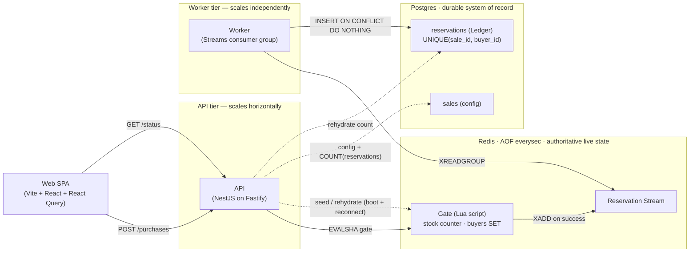
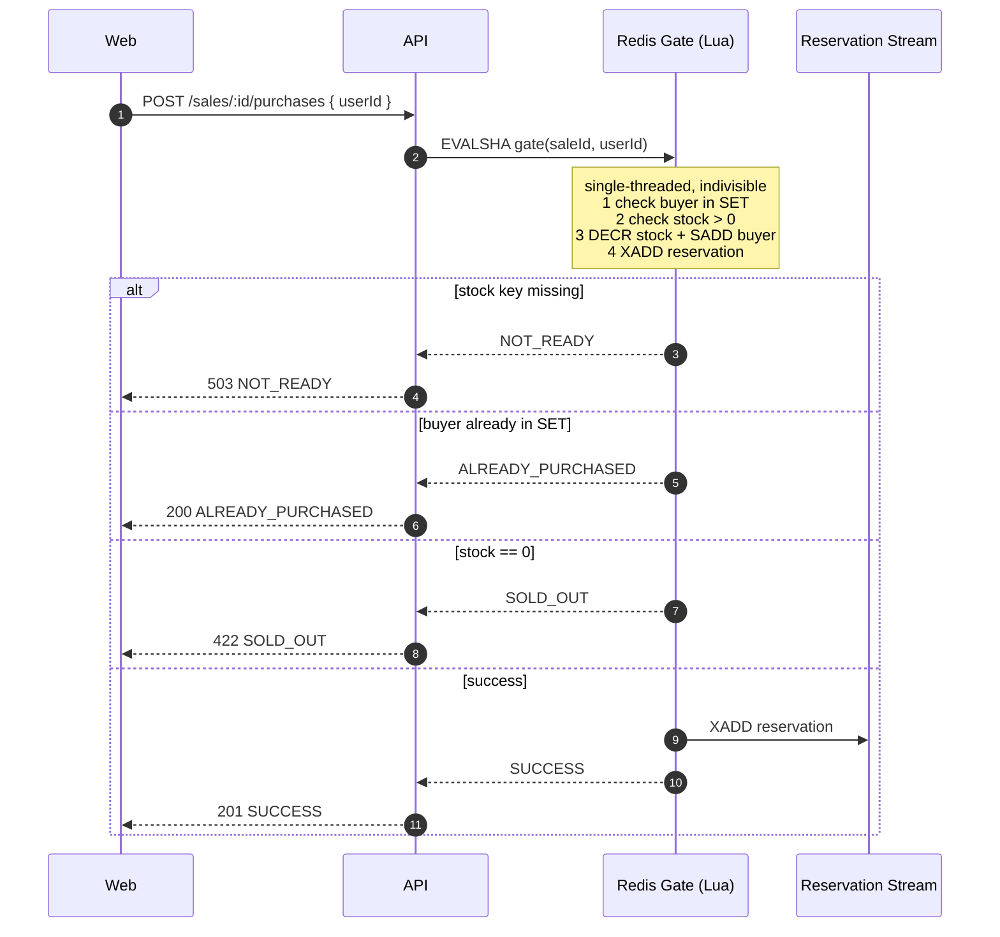
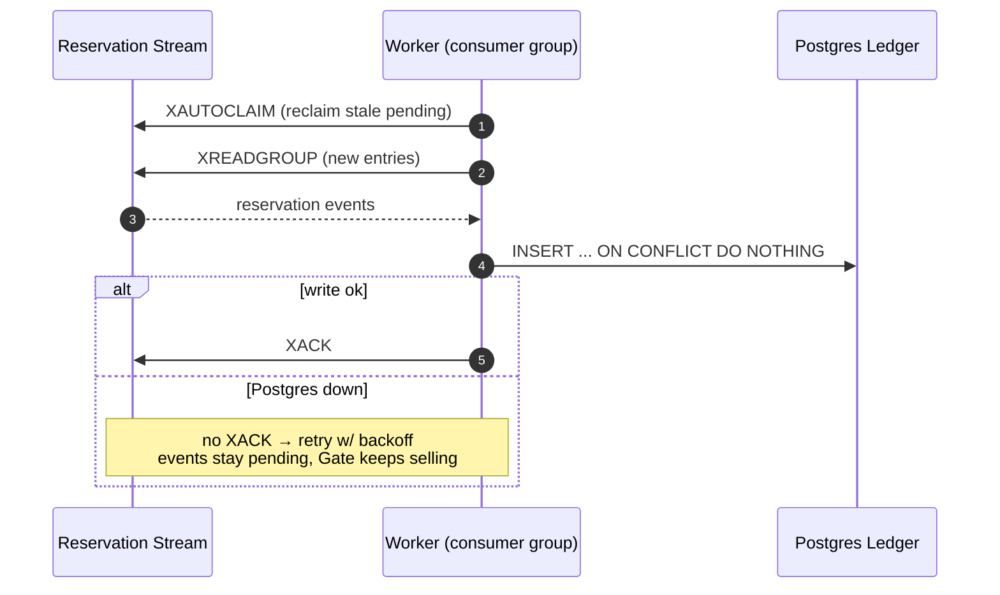
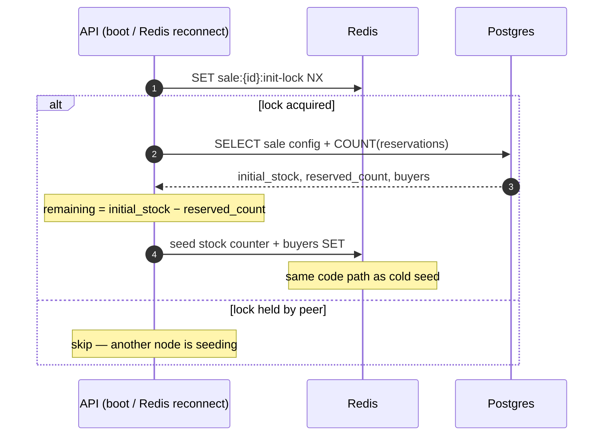

# Rush Sale

A high-throughput **flash-sale** platform for a single limited-stock product. Thousands of
buyers contend for a small stock; the system must **never oversell** and must enforce
**one item per user**, under spike load, within a configurable sale window.

The design centre of gravity is a single **Redis atomic Gate**: one Lua script decides
"decrement stock if available AND this buyer has none" as one indivisible operation. Redis
is single-threaded, so oversell and double-buys are *structurally* impossible — there is no
race window to lose. Durability is handled off the hot path by a separate **worker** that
drains a Redis Stream into a Postgres **Ledger** (the system of record).

## Architecture at a glance



- **Redis** is authoritative for *live* stock during an active sale (AOF, `appendfsync everysec`).
- **Postgres** is the durable record and the **rehydration** source if Redis state is lost.
- **API** and **worker** are separate processes: a DB outage stalls only the worker (events
  buffer in the Stream) while the Gate keeps serving `SUCCESS`.

### Purchase — hot path



No oversell + one-per-user are decided inside one Lua script. Redis being single-threaded
means there is no race window — the event is enqueued the instant the Reservation exists,
so there is no dual-write gap.

### Persistence — worker drains the Stream



At-least-once delivery → the Ledger write must be idempotent. The natural key
`UNIQUE(sale_id, buyer_id)` makes the write exactly-once **and** is a DB-level
defense-in-depth backstop for one-per-user.

### Rehydration — recover live state from the Ledger



Boot seed and post-crash rehydrate are the **same** code path. AOF can lose ≤1s on a hard
crash; the Ledger backstops it so a cold rebuild can never oversell (ADR-0004).

### Failure modes

| Failure | Behaviour | Why it holds |
|---|---|---|
| Traffic spike (thundering herd) | Gate serializes atomically in Redis | single-threaded, no row lock contention |
| Postgres down | Gate keeps serving; events buffer in Stream | worker decoupled, never acks until write ok |
| Redis crash (AOF intact) | restart → AOF replays live state | `appendfsync everysec`, ≤1s loss |
| Redis state lost (AOF gone) | rehydrate from Ledger on boot | `remaining = initial − COUNT(reservations)` |
| Duplicate Stream delivery | second Ledger insert is a no-op | `ON CONFLICT DO NOTHING` on natural key |
| Double-click / retry buy | `ALREADY_PURCHASED`, not an error | buyer SET checked inside the Gate |

> The same diagrams are mirrored in [`../docs/architecture.md`](../docs/architecture.md).

## Why this holds up

| Concern | Mechanism |
|---|---|
| No oversell under spike | Single Lua script in single-threaded Redis — no race window |
| One per user | Buyer SET checked *inside* the same Gate script |
| Exactly-once persistence | At-least-once Stream + `UNIQUE(sale_id, buyer_id)` + `ON CONFLICT DO NOTHING` |
| DB outage | Worker stops acking; Gate keeps selling; Stream buffers until recovery |
| Total Redis state loss | Rehydrate on boot: `remaining = initial_stock − COUNT(reservations)`, buyer SET rebuilt |
| Crash window | AOF `everysec` loses ≤1s; the Ledger backstops a cold rebuild so it can't oversell |

## Stack

TypeScript · Turborepo + pnpm · NestJS on the **Fastify** adapter · **ioredis**
(`defineCommand` registers the Gate as a typed `EVALSHA`) · **Drizzle** + Postgres ·
Vite + React (Rolldown/Oxc) + TanStack Query · pino · Terminus health checks · Vitest +
Testcontainers · k6 · Biome (one-config lint + format) · Docker / Compose.

```
apps/
  api/    NestJS API (main.ts) + Streams worker (worker.ts), Drizzle schema, Redis Gate
  web/    Vite + React SPA — sale status + Buy button
  load/   k6 stress + correctness scenarios
```

## Prerequisites

- Docker (everything else runs in containers)
- For local (non-container) dev: Node ≥ 22 (developed on 26) + `pnpm`
- [k6](https://grafana.com/docs/k6/latest/set-up/install-k6/) for the load scenarios

## Run it — fully containerized (one command)

```bash
pnpm up        # docker compose --profile app up -d --build
```

This builds and starts the whole stack: Redis, Postgres, a one-shot **migrate** (pushes the
Drizzle schema, then exits), the **API** (:3000, seeds `launch-2026` on boot), the **worker**
(Stream → Ledger), and the **web** SPA on **http://localhost:5173** (nginx). `depends_on`
health/`completed_successfully` gates ordering, so the API only starts once the schema is in
place. Tear down with:

```bash
pnpm down      # stop + remove the app containers (keeps Redis/Postgres volumes)
```

The app services live behind a Compose `app` profile, so `pnpm infra:up` (below) still brings
up Redis + Postgres only.

## Run it — local dev (hot reload)

```bash
pnpm install
cp .env.example .env          # localhost defaults match docker-compose

pnpm infra:up                 # Redis + Postgres only
pnpm --filter @rush-sale/api db:push   # create tables

# two processes, two terminals:
pnpm --filter @rush-sale/api dev          # API on :3000 (seeds the default sale)
pnpm --filter @rush-sale/api dev:worker   # Stream → Ledger worker

pnpm --filter @rush-sale/web dev          # SPA on :5173
```

A default sale (`launch-2026`, stock 1000) is seeded from `.env` on API boot. Create more
via `POST /sales`.

## API

| Method | Path | Purpose |
|---|---|---|
| `GET`  | `/sales/:id/status` | product, status (`UPCOMING`/`ACTIVE`/`ENDED`), live remaining |
| `POST` | `/sales/:id/purchases` | body `{ "userId": "..." }` — attempt to secure the item |
| `GET`  | `/sales/:id/purchases/:userId` | has this buyer secured one? |
| `POST` | `/sales` | admin: define a sale (idempotent on `id`) |
| `GET`  | `/health` · `/ready` | liveness · readiness (Redis + Postgres) |

**Purchase outcomes** — the body `outcome` is authoritative, HTTP status mirrors it (ADR-0003):

| `outcome` | HTTP | Meaning |
|---|---|---|
| `SUCCESS` | 201 | reservation created |
| `ALREADY_PURCHASED` | 200 | buyer already has one (not an error) |
| `SOLD_OUT` | 422 | stock exhausted |
| `NOT_ACTIVE_UPCOMING` | 409 | sale hasn't started |
| `NOT_ACTIVE_ENDED` | 410 | sale is over |
| `NOT_READY` | 503 | sale not seeded yet (≠ sold out) |

```bash
curl -X POST localhost:3000/sales/launch-2026/purchases \
  -H 'content-type: application/json' -d '{"userId":"alice"}'
# {"outcome":"SUCCESS","remaining":999,"reservationId":"...-0", ...}
```

## Tests

```bash
pnpm --filter @rush-sale/api test        # unit (no Docker)
pnpm --filter @rush-sale/api test:int    # integration — boots a REAL Redis via Testcontainers
```

The integration suite is the correctness centrepiece: 1000 concurrent buyers against 100
stock yields **exactly 100 `SUCCESS`**, the rest `SOLD_OUT`; a 200-call retry storm from one
buyer yields **exactly one `SUCCESS`** and 199 `ALREADY_PURCHASED`. Only a real Redis can run
the Lua `EVAL` the proof depends on.

## Lint & format

A single root [Biome](https://biomejs.dev) config (`biome.json`) lints and formats the whole
workspace — one toolchain, one pass:

```bash
pnpm lint      # biome check .  (lint + format diagnostics)
pnpm format    # biome check --write .  (apply safe fixes)
```

## Stress testing (k6)

```bash
cd apps/load
pnpm herd          # 1: thundering herd — 5k rps spike, p99 < 250ms, never oversells
pnpm one-per-user  # 2: 50 buyers × 40 retries — at most one SUCCESS each
pnpm window        # 3: outcomes match the live sale window (upcoming/active/ended)
pnpm fault-redis   # 4: kill Redis mid-run (see script) — fails clean, recovers, no oversell
```

Each scenario encodes its pass/fail as **k6 thresholds**, so a run exits non-zero the moment
an invariant breaks — no eyeballing required:

- **herd** — `outcome_success ≤ 1000` (`abortOnFail`: oversell kills the run instantly),
  `p95 < 150ms`, `p99 < 250ms`, `http_req_failed < 1%`, `checks > 99%`.
- **one-per-user** — `outcome_success ≤ 50` (`abortOnFail`: one per buyer), `checks > 99%`.
- **window** — `checks > 99%` that every outcome agrees with the live sale window.
- **fault-redis** — failures tolerated during the outage (`http_req_failed < 40%`), but the
  no-oversell check must hold on **every** request (`checks > 99.9%`, `abortOnFail`).

**Cross-checked against the DB after any run (the invariant, independent of k6):**

```sql
-- never more reservations than stock, and no buyer twice:
SELECT count(*) FROM reservations WHERE sale_id = 'launch-2026';            -- ≤ initial_stock
SELECT sale_id, buyer_id, count(*) FROM reservations
  GROUP BY 1,2 HAVING count(*) > 1;                                         -- 0 rows
```

For scenario 4, restart Redis with `docker compose restart redis` (AOF replays) or wipe its
volume to force a **cold rehydrate from the Ledger** — either way the invariant holds.

## Teardown

```bash
pnpm infra:down    # stop + remove volumes
```
