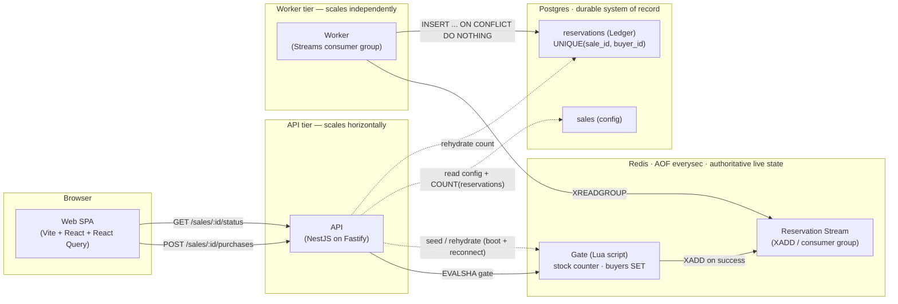
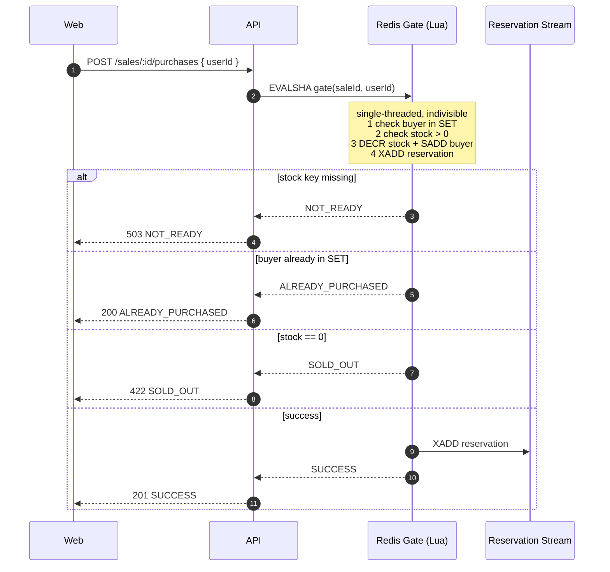
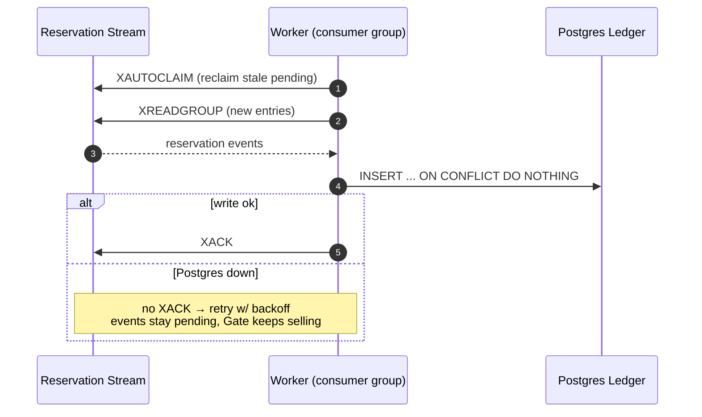
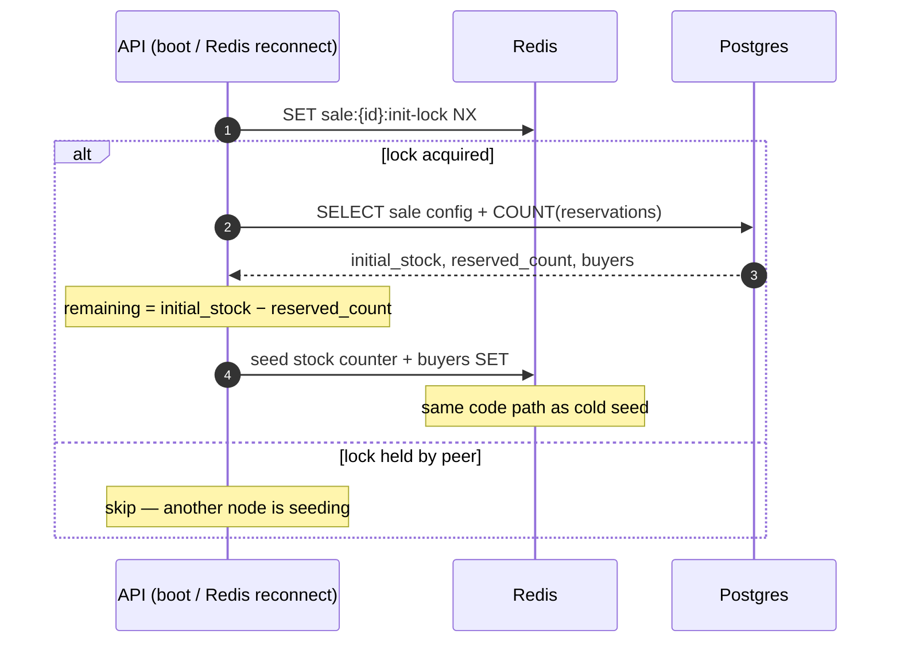

# Rush Sale — System Architecture

High-throughput flash-sale platform. Hot path is a single **Redis atomic Gate** (oversell
structurally impossible); durability is an async **Postgres Ledger** fed by a separate
**worker** over Redis Streams. See the [ADRs](./adr) for the reasoning.

## Containers



**Why split API and worker:** API stays on the hot path and never blocks on Postgres. If
the DB stalls, the worker simply stops acking — events buffer in the Stream, the Gate keeps
serving `SUCCESS`. They scale and fail independently (ADR-0001, ADR-0005).

## Purchase — hot path



No oversell + one-per-user are decided inside one Lua script. Redis being single-threaded
means there is no race window — the event is enqueued the instant the Reservation exists,
so there is no dual-write gap.

## Persistence — worker drains the Stream



At-least-once delivery → the Ledger write must be idempotent. The natural key
`UNIQUE(sale_id, buyer_id)` makes the write exactly-once **and** is a DB-level
defense-in-depth backstop for one-per-user.

## Rehydration — recover live state from the Ledger



Boot seed and post-crash rehydrate are the **same** code path. AOF can lose ≤1s on a hard
crash; the Ledger backstops it so a cold rebuild can never oversell (ADR-0004).

## Failure modes

| Failure | Behaviour | Why it holds |
|---|---|---|
| Traffic spike (thundering herd) | Gate serializes atomically in Redis | single-threaded, no row lock contention |
| Postgres down | Gate keeps serving; events buffer in Stream | worker decoupled, never acks until write ok |
| Redis crash (AOF intact) | restart → AOF replays live state | `appendfsync everysec`, ≤1s loss |
| Redis state lost (AOF gone) | rehydrate from Ledger on boot | `remaining = initial − COUNT(reservations)` |
| Duplicate Stream delivery | second Ledger insert is a no-op | `ON CONFLICT DO NOTHING` on natural key |
| Double-click / retry buy | `ALREADY_PURCHASED`, not an error | buyer SET checked inside the Gate |
```
