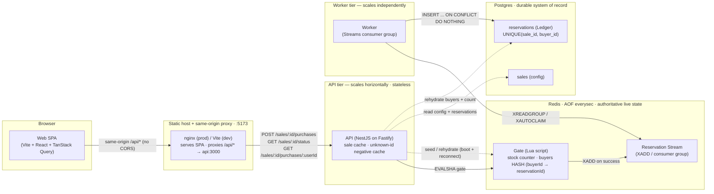
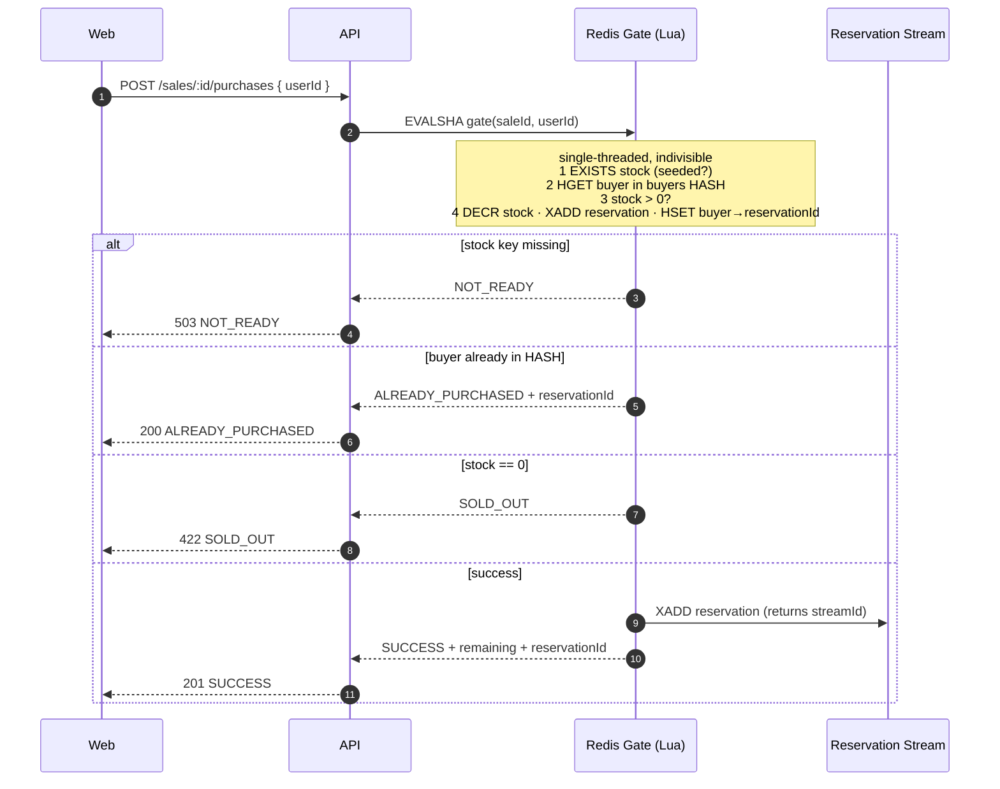
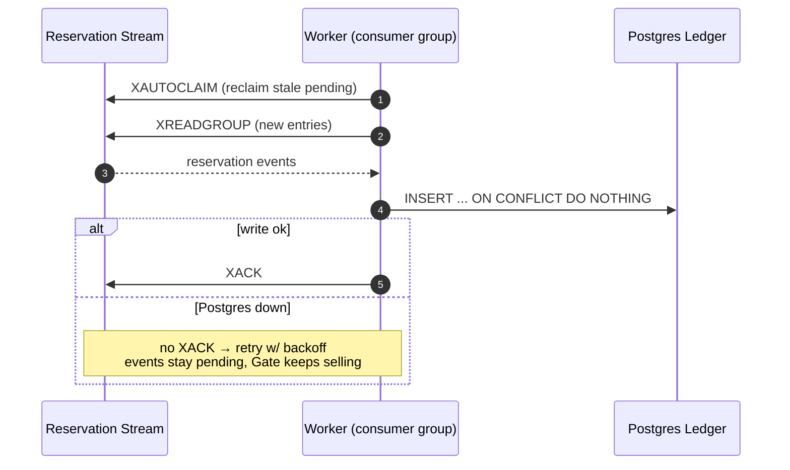
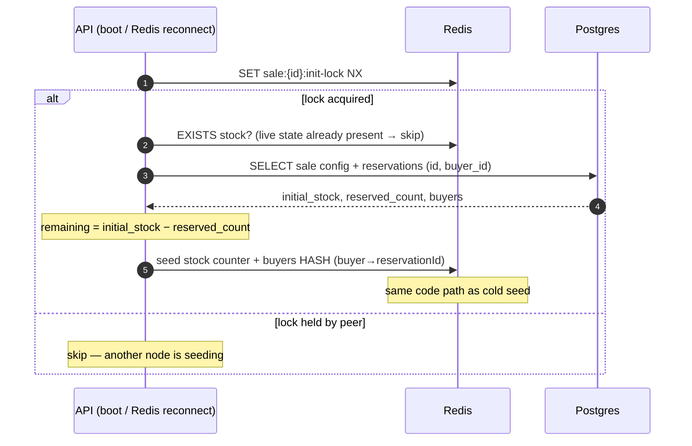

# Rush Sale — System Architecture

High-throughput flash-sale platform. Hot path is a single **Redis atomic Gate** (oversell
structurally impossible); durability is an async **Postgres Ledger** fed by a separate
**worker** over Redis Streams. See the [ADRs](./adr) for the reasoning.

## Components at a glance

| Component | Responsibility | Why it exists |
|---|---|---|
| **Web SPA** | Status display, countdown, Buy button | Thin client; never trusted for invariants |
| **Edge proxy** (nginx prod / Vite dev) | Serve SPA + proxy `/api/*` → API, same-origin | No CORS, no host-specific URLs (ADR drop-CORS) |
| **API** (NestJS/Fastify) | HTTP surface; calls the Gate; seeds/rehydrates | Stateless, scales horizontally; off the DB hot path |
| **Redis Gate** (Lua) | Authoritative *live* stock + one-per-user | Single-threaded ⇒ no race window, no oversell |
| **Reservation Stream** | Durable buffer of successful reservations | Decouples the hot path from Postgres |
| **Worker** | Drains Stream → Ledger, idempotently | DB outage stalls only this, not selling |
| **Postgres** | `sales` config + `reservations` Ledger (record) | Durable source of truth + rehydration source |

## Containers

**Why split API and worker:** API stays on the hot path and never blocks on Postgres. If
the DB stalls, the worker simply stops acking — events buffer in the Stream, the Gate keeps
serving `SUCCESS`. They scale and fail independently (ADR-0001, ADR-0005).

**Why the same-origin proxy:** the browser only ever calls its own origin (`/api/*`); the
edge proxy forwards to the API. No CORS preflight, no hard-coded API host — the storefront
works wherever the host port is reached. Non-browser clients ignore CORS anyway.

## Purchase — hot path

No oversell + one-per-user are decided inside one Lua script. Redis being single-threaded
means there is no race window — the event is enqueued the instant the reservation exists, so
there is no dual-write gap. The reservation's stream id **is** its `reservationId`: it is
written into the buyers HASH, so a repeat attempt echoes the original (idempotent receipt)
and `GET /sales/:id/purchases/:userId` can return it.

> The status endpoint (`GET /sales/:id/status`) reports lifecycle (`UPCOMING`/`ACTIVE`/
> `ENDED`), but collapses `ACTIVE` → `SOLD_OUT` when live remaining is `0`, using the same
> Gate read it already needs (no extra round trip).

## Persistence — worker drains the Stream

At-least-once delivery → the Ledger write must be idempotent. The natural key
`UNIQUE(sale_id, buyer_id)` makes the write exactly-once **and** is a DB-level
defense-in-depth backstop for one-per-user. The stream id is reused as the row id for
end-to-end traceability.

## Rehydration — recover live state from the Ledger

Boot seed and post-crash rehydrate are the **same** code path. The seed is skipped when live
state already exists, so an intact AOF is never clobbered with the (lagging) Ledger count.
AOF can lose ≤1s on a hard crash; the Ledger backstops it so a cold rebuild can never
oversell (ADR-0004).

## Failure modes

| Failure | Behaviour | Why it holds |
|---|---|---|
| Traffic spike (thundering herd) | Gate serializes atomically in Redis | single-threaded, no row lock contention |
| Postgres down | Gate keeps serving; events buffer in Stream | worker decoupled, never acks until write ok |
| Redis crash (AOF intact) | restart → AOF replays live state | `appendfsync everysec`, ≤1s loss |
| Redis state lost (AOF gone) | rehydrate from Ledger on boot | `remaining = initial − COUNT(reservations)` |
| Duplicate Stream delivery | second Ledger insert is a no-op | `ON CONFLICT DO NOTHING` on natural key |
| Double-click / retry buy | `ALREADY_PURCHASED` + original id, not an error | buyer HASH checked inside the Gate |
| Flood of bogus sale ids | bounded negative cache absorbs repeats | capacity-capped + TTL'd, can't OOM |

## Concurrency & oversell — why it can't happen

The invariant: **at most `initialStock` reservations, at most one per buyer.** It is enforced
structurally, not probabilistically.

Every buy is one Lua script run by Redis's **single thread**. `EXISTS → HGET buyer → check
stock → DECR · XADD · HSET` is therefore *indivisible*: no other command interleaves between
the stock check and the decrement, so the classic check-then-act (TOCTOU) race has **no
window** to occur. Two requests for the last unit cannot both read `stock = 1` — the second
sees `0` because the first's `DECR` already committed.

Contrast the alternatives we rejected:

| Approach | Why it loses |
|---|---|
| App-level read-modify-write | TOCTOU race: two API replicas both read stock, both sell |
| `SELECT … FOR UPDATE` per buy | Correct, but row-lock contention serializes the hot path **on Postgres** and couples selling to DB availability |
| Optimistic `UPDATE … WHERE stock>0` | Correct, but every buy hits Postgres; lock/retry storms under a herd |
| **Lua Gate (chosen)** | Serialization happens in-memory in Redis (µs/op); correctness is *structural*, and selling never touches the DB |

**Defense in depth** — three independent layers, so no single bug oversells:

1. **Gate (Lua)** — primary guard on live state; prevents oversell and double-buy.
2. **`UNIQUE(sale_id, buyer_id)`** in the Ledger — a duplicate Stream delivery or a worker
   bug still cannot write a second row (`ON CONFLICT DO NOTHING`).
3. **Rehydration math** — a cold rebuild seeds `remaining = initialStock − COUNT(reservations)`
   and *skips* when live state already exists, so recovery can never resurrect sold units.

## Scaling & bottlenecks

Each tier scales on a different lever. The honest ceiling is the **single Redis node**; the
mitigation is built into the key layout.

| Tier | Scale lever | Bottleneck / ceiling | Mitigation |
|---|---|---|---|
| **Edge proxy** | stateless → add replicas | open-connection limit | L4 load balancer, more proxy pods |
| **API** | stateless → add replicas | CPU per request; no shared state | horizontal autoscale behind the proxy |
| **Worker** | competing-consumer group → add consumers | drain rate vs. arrival rate (Stream backlog) | scale consumers out; `XAUTOCLAIM` covers a dead one; batch (`COUNT 128`) |
| **Redis Gate** | one node, single-threaded | **~10⁵ ops/s on one node + it's a SPOF** | shard by `saleId` (keys are already `sale:{id}:*`, streams per-sale) across Redis Cluster; HA via Sentinel / managed Redis |
| **Postgres** | off the hot path | worker write throughput | batched inserts / `COPY`, partition by `sale_id`; lag is tolerable — it's never on the buy path |
| **Reservation Stream** | per-sale, `XADD` is O(1) | unbounded growth if never trimmed | `XTRIM`/approx `MAXLEN` after the backlog drains; pending-list size is the true backpressure signal |

**The single-Redis story, honestly.** One node is both the throughput ceiling and a single
point of failure. Two levers, no rewrite:

- **More concurrent sales** → shard by `saleId`. Every key is namespaced `sale:{id}:*` and each
  sale owns its own Stream, so a Redis Cluster spreads sales across shards with zero code
  change to the Gate (it operates on one sale's keys, all on the same slot via the `{id}` hash
  tag).
- **One hotter-than-a-node sale** → this is the single-product limit by design; the lever is a
  bigger / faster box. The Gate op is tiny and O(1), so a single node already absorbs a very
  large herd before this bites. Beyond that, partition the *stock itself* (N sub-counters) —
  deliberately deferred (ADR-0001) as out of scope for one product.
- **Availability** → Redis Sentinel or a managed HA Redis; AOF + the Ledger mean a failover or
  cold start rebuilds correct live state (see *Resilience*).

## Resilience under load

What heavy load actually breaks in a DB-centric flash sale — lock contention, connection-pool
exhaustion, dual-write gaps — is absent here, because **buying never touches Postgres**.

| Under load | Behaviour | Why it degrades gracefully |
|---|---|---|
| Thundering herd | Gate serializes atomically in-memory | no row locks, no pool exhaustion; µs/op |
| Worker falls behind | Stream backlog grows, **selling continues** | persistence is async; the Gate is the source of live truth |
| Postgres outage | Gate keeps selling; worker stops acking, events stay pending | worker decoupled; flushes on recovery, idempotently |
| API replica dies mid-request | LB reroutes; client retries | buy is idempotent — a retry returns `ALREADY_PURCHASED` + original id |
| Worker dies with pending entries | another consumer reclaims after 30s | `XAUTOCLAIM(CLAIM_IDLE_MS)` — no reservation stranded |
| Redis crash (AOF intact) | restart replays live state | `appendfsync everysec` → ≤1s loss |
| Redis state lost | rehydrate from Ledger on boot | `remaining = initial − COUNT(reservations)` |
| Bogus-id flood | absorbed by the bounded negative cache | capacity-capped + TTL'd → DB stays off the hot path, can't OOM |

**Not yet built, the obvious next levers:** per-user / per-IP **rate limiting at the edge**
(shed abuse before it reaches the Gate) and **Stream `MAXLEN` trimming** (bound memory under a
sustained spike). See [troubleshooting.md](./troubleshooting.md#performance--load-symptom--bottleneck--mitigation)
for the operational runbook.
